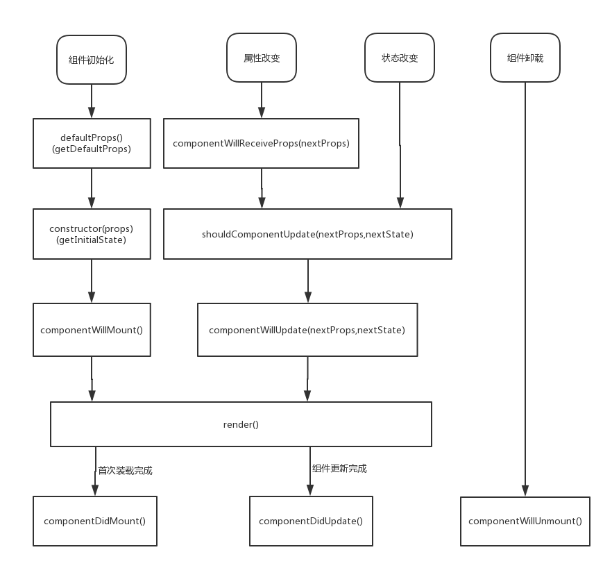

# React生命周期图解

# 详细说明

生命周期包含4种情况：组件初始化装载时候，组件属性改变时候，组件状态改变时候，组件被销毁时候

生命周期共提供了10个不同的API。

## defaultProps

ES6使用defaultProps()方法，ES5中getDefaultProps()方法。只调用一次，返回对象用于设置默认的props，但是对于引用值会在各个实例中共享。

## constructor(props)

构造函数，实例创建的时候调用，主要为了初始化state或绑定this，ES5中用getInitialState()

## componentWillMount()

第一次渲染阶段在调用render方法前会调用，此时仍然可以修改组件的state

## render()

必选方法，创建虚拟DOM，该方法具有特殊规则：

- 只能通过this.props和this.state访问数据
- 可以返回null、false或任何React组件
- 只能出现一个顶级组件（不能返回数组）
- 不能改变组件的状态state
- 不能修改DOM的输出

## componentDidMount

首次装载渲染完成，真实的DOM被渲染出来后调用，可以做一些依赖DOM的操作，比如利用refs获取DOM。子组件比父组件优先渲染，所以可以获取子组件对应的DOM。

注意：在服务端中，该方法不会被调用！

## componentWillReciveProps(nextProps)

组件接受到新的props时候调用，此时可以根据nextProps来修改state。

注意：这个时候虽然说是获取新的属性，但是并不能保证属性一定发生了改变。

## shouldComponentUpdate(nextProps, nextState)

接受到新的属性或者新的状态的时候在render前会被调用。除了调用forceUpdate和初始化渲染以外。

该方法让我们有机会决定是否重新渲染组件，返回false，那么不会重新渲染组件，借此可以优化性能，除非特殊情况比如在组件很多性能瓶颈，大多数情况不推荐使用。

## componentWillUpdate(nextProps, nextState)

当组件确定要更新，render之前被调用。

这个时候可以确定一定会更新组件，可以执行更新前的操作。此时不能更新修改state和props！

## componentDitUpdate()

完成渲染新的props或者state后调用，此时可以访问到新的DOM元素。

## componentWillUnmount()

组件被卸载之前调用，可以用于做一些清理工作，在componentDidMount方法中添加的所有任务都需要在该方法中撤销，比如创建的定时器或添加的事件监听器。
